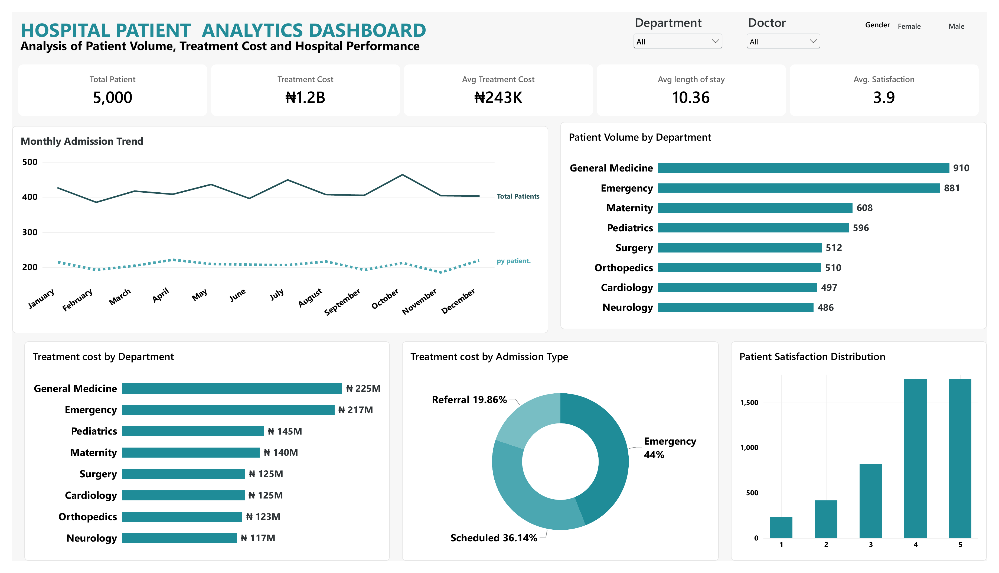
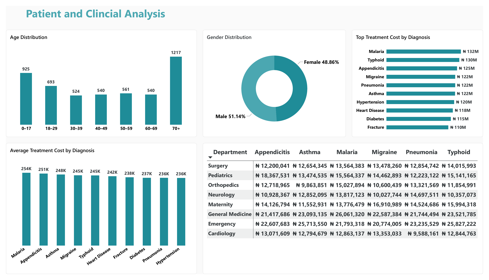
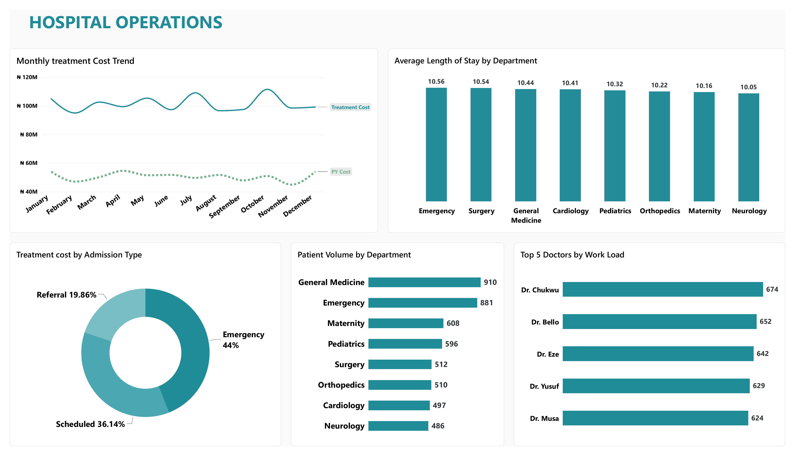
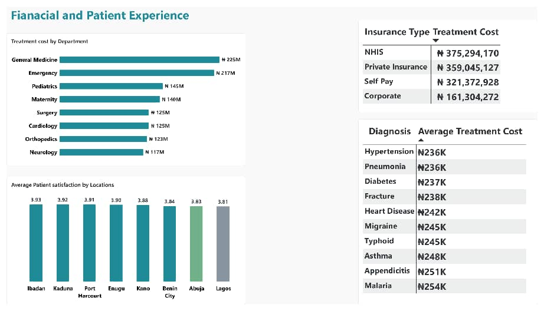

# Hospital Operations & Patient Insights Dashboard

## Project Overview

This project analyzes 5,000 hospital patient records to uncover insights into patient demographics, hospital admissions, treatment costs, length of stay, departmental activity, insurance coverage, and patient satisfaction.

The project combines SQL analysis with an interactive Power BI dashboard to transform raw patient data into meaningful business and operational insights.

## Business Questions

- How many patients were admitted?
- Which departments handled the highest patient volumes?
- What were the most common diagnoses?
- How did treatment costs vary across departments and diagnoses?
- What was the average length of stay?
- Which admission type was most common?
- How was the patient population distributed by age and gender?
- How did patient satisfaction vary across locations?
- How did treatment costs vary by insurance type?
- What relationship existed between treatment cost and length of stay?

## Key Performance Indicators

| KPI | Result |
|---|---:|
| Total Patients | 5,000 |
| Total Treatment Cost | ₦1.2B |
| Average Treatment Cost | ₦243K |
| Average Length of Stay | 10.36 days |
| Average Patient Satisfaction | 3.9 / 5 |

## Key Insights

- Emergency admissions represented approximately 44% of all admissions.
- Patients aged 70+ represented the largest age group in the dataset.
- General Medicine recorded the highest patient volume.
- Treatment cost showed a strong positive relationship with length of stay.
- Malaria recorded one of the highest total treatment costs among the diagnoses analyzed.
- Patient satisfaction varied across locations, with average scores remaining around the 3.8–3.9 range.
- NHIS accounted for the largest share of total treatment cost among the insurance types analyzed.

## Dashboard Pages

### 1. Executive Overview

Provides a high-level view of patient volume, treatment cost, average length of stay, patient satisfaction, admission trends, and departmental activity.



### 2. Patient & Clinical Analysis

Explores age distribution, gender distribution, treatment cost by diagnosis, average treatment cost, and departmental diagnosis patterns.



### 3. Hospital Operations

Examines monthly treatment cost trends, average length of stay by department, admission types, departmental patient volume, and operational activity.



### 4. Financial & Patient Experience

Analyzes treatment costs by department, insurance type, diagnosis, and patient satisfaction across locations.



## Tools Used

- *Power BI* – Dashboard development and data visualization
- *DAX* – Calculations and KPI measures
- *SQL* – Data analysis and querying
- *Data Cleaning* – Data preparation and validation
- *Data Visualization* – Interactive charts and dashboard design

## Project Structure

```text
hospital-operations-patients-insights/
│
├── README.md
├── hospital_analysis_cleaned.sql
│
├── 01_Executive_Overview.png
├── 02_Patient_Clinical_Analysis.png
├── 03_Hospital_Operations.png
└── 04_Financial_Patient_Experience.png
